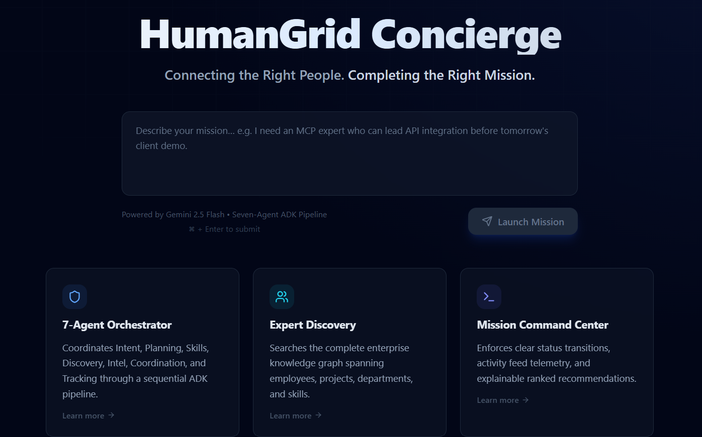
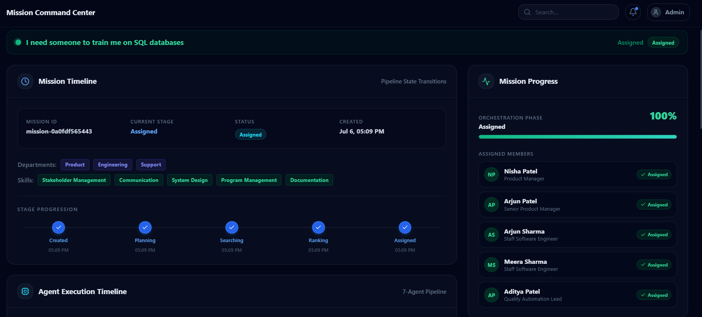
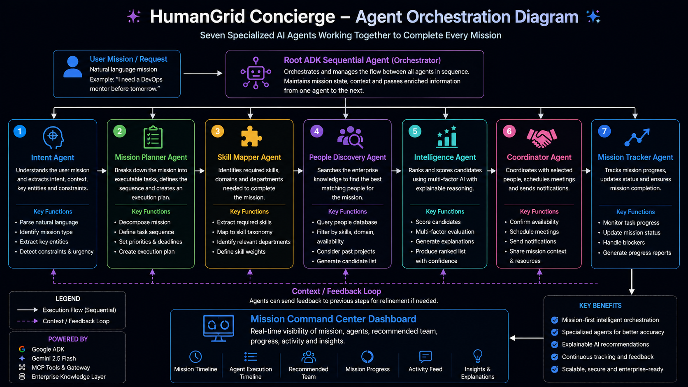

# 🚀 HumanGrid Concierge

## Connecting the Right People. Completing the Right Mission.

> **Competition:** Kaggle AI Agents Intensive Capstone 2026  
> **Track:** Concierge Agents

HumanGrid Concierge is an **Enterprise AI Concierge Platform** that helps employees accomplish missions instead of searching for people.

Rather than manually browsing employee directories, messaging coworkers, or relying on organizational knowledge, employees simply describe **what they want to accomplish**.

The AI Concierge intelligently understands the mission, discovers the right experts, coordinates collaboration, and continuously tracks execution through a team of specialized AI agents.

> **This is not a chatbot.**  
> HumanGrid Concierge is a multi-agent orchestration platform designed for enterprise collaboration.

---

# 🌟 Problem Statement

Modern enterprises possess enormous amounts of talent distributed across departments, projects, and locations.

Unfortunately, employees often spend hours trying to answer questions like:

- Who knows Kubernetes?
- Who worked on our previous AI project?
- Who can review my client demo?
- Who is available tomorrow?
- Who can mentor me in DevOps?

Traditional employee directories only store information.

They do **not understand intent**.

They cannot reason about:

- skills
- availability
- trust
- workload
- previous collaborations
- project relevance

HumanGrid Concierge solves this problem.

---

# 💡 Solution

HumanGrid Concierge acts as an **AI Concierge** for the enterprise.

Instead of searching for people...

Employees simply describe their mission.

Example:

> "I need a DevOps mentor before tomorrow."

The platform automatically:

- understands the mission
- creates an execution plan
- maps required skills
- discovers experts
- ranks candidates using explainable AI
- coordinates selected employees
- tracks mission progress

Everything happens automatically through a coordinated workflow of specialized AI agents.

---

# ✨ Key Features

- 🤖 7-Agent AI Concierge Workflow
- 🔍 Enterprise Expert Discovery
- 🧠 Explainable AI Recommendations
- 🔌 MCP Server Integration
- 📊 Mission Command Center Dashboard
- 📅 Calendar & Availability Matching
- 📈 Mission Progress Tracking
- 🧩 Enterprise Knowledge Graph
- ⚡ FastAPI Backend
- 🎨 Next.js Frontend
- 🧠 Gemini 2.5 Flash Integration
- 📂 JSON Enterprise Knowledge Store

---

# 🏗 System Architecture

```text
                        User
                          │
                          ▼
                Landing Page (Next.js)
                          │
                          ▼
                  Mission Engine API
                          │
                          ▼
               Root ADK Sequential Agent
                          │
        ┌─────────────────┴─────────────────┐
        ▼                                   ▼
 Intent Agent                   Mission Planner Agent
        │                                   │
        ▼                                   ▼
 Skill Mapper Agent          People Discovery Agent
                                        │
                                        ▼
                               MCP Gateway Server
                                        │
        ┌─────────────────────────────────────────────────┐
        │ Enterprise Knowledge Layer                      │
        │                                                 │
        │ Employees                                       │
        │ Projects                                        │
        │ Skills                                          │
        │ Departments                                     │
        │ Calendar                                        │
        │ Missions                                        │
        │ Notifications                                   │
        └─────────────────────────────────────────────────┘
                                        │
                                        ▼
                          Intelligence Agent
                                        │
                                        ▼
                           Coordinator Agent
                                        │
                                        ▼
                         Mission Tracker Agent
                                        │
                                        ▼
                     Mission Command Center Dashboard
```

---

# 🤖 Seven-Agent Workflow

| Agent | Responsibility |
|---------|----------------|
| Intent Agent | Understands the user's mission |
| Mission Planner Agent | Converts the mission into executable tasks |
| Skill Mapper Agent | Identifies required skills and departments |
| People Discovery Agent | Searches the enterprise knowledge graph |
| Intelligence Agent | Ranks candidates using explainable AI |
| Coordinator Agent | Coordinates meetings and notifications |
| Mission Tracker Agent | Tracks mission execution and updates progress |

---

# MCP Server

HumanGrid Concierge uses a centralized Model Context Protocol (MCP) server as the secure gateway between AI agents and enterprise knowledge.

Instead of allowing agents to directly access organizational data, all information retrieval and operational actions are performed through permission-controlled MCP tools.

The MCP Gateway enforces:

- Agent-level authorization
- Tool-level access policies
- Structured request logging
- Standardized enterprise interfaces

### Enterprise Capabilities

The MCP server exposes capabilities for:

- Employee discovery
- Organizational expertise lookup
- Project intelligence
- Mission lifecycle management
- Calendar coordination
- Notification orchestration
- Workload analytics
- Team composition analysis

Only authorized agents invoke these capabilities based on their assigned responsibilities within the orchestration pipeline.


## Enterprise Knowledge Layer

HumanGrid Concierge uses a structured Enterprise Knowledge Layer that exposes organizational intelligence through a centralized Model Context Protocol (MCP) server.

The knowledge layer provides enterprise-wide access to:

- Employee expertise and profiles
- Department relationships
- Organizational skill taxonomy
- Historical project experience
- Mission lifecycle records
- Team availability
- Collaboration insights
- Organizational notifications

All knowledge is accessed through MCP tools, allowing AI agents to retrieve contextual information using standardized tool interfaces instead of directly interacting with underlying storage.
---

# 📊 Mission Command Center

The dashboard visualizes the complete mission lifecycle.

Widgets include:

- Mission Timeline
- Agent Execution Timeline
- Recommended Team
- Mission Progress
- Activity Feed
- Intelligence Explanation
- Enterprise Knowledge Graph

The dashboard updates after every mission request and provides explainable AI recommendations.

---

# 🛠 Technology Stack

## Backend

- Python 3.11
- FastAPI
- Google ADK
- Gemini 2.5 Flash
- MCP Python SDK
- Pydantic

## Frontend

- Next.js 15
- React 19
- TailwindCSS
- Framer Motion
- shadcn/ui

## Storage

- JSON Knowledge Store

---

# 📁 Project Structure

```text
HumanGrid-Concierge
│
├── backend/
│   ├── app/
│   ├── data/
│   ├── tests/
│   └── ...
│
├── frontend/
│   ├── app/
│   ├── components/
│   ├── context/
│   ├── services/
│   └── ...
│
├── outputs/
├── README.md
├── .gitignore
└── .agents-cli-spec.md
```

---

# 🚀 Getting Started

## Clone the Repository

```bash
git clone https://github.com/Shashank-m-m26/Human_Grid.git
cd Human_Grid
```

---

## Backend

```bash
cd backend

uv sync

uv run uvicorn app.main:app --reload
```

Runs at:

```
http://localhost:8000
```

---

## Frontend

```bash
cd frontend

npm install

npm run dev
```

Runs at:

```
http://localhost:3000
```

---

# 🔑 Environment Variables

Create a `.env` file inside the backend folder.

```env
GOOGLE_API_KEY=YOUR_GOOGLE_API_KEY
```

Obtain an API key from:

https://aistudio.google.com/apikey

---

# 🧪 Sample Missions

### Example 1

```
I need a DevOps mentor before tomorrow.
```

Expected Flow

Intent → Planning → Skill Mapping → Expert Discovery → Ranking → Coordination → Tracking

---

### Example 2

```
I need reviewers for my client demo.
```

---

### Example 3

```
I need a cross-functional hackathon team.
```

---

# 🔒 Security

HumanGrid Concierge incorporates several security mechanisms:

- HTTP Basic Authentication
- MCP Tool Permission Enforcement
- Request Context Middleware
- Structured Logging
- Environment Variable Protection
- Explainable Recommendation Pipeline

---

# 📸 Screenshots

### Landing Page



### Mission Dashboard



### Agent Orchestration



---

# 🎥 Demo Video

YouTube Demo:

https://www.youtube.com/watch?v=uaLujMwuD-o

---

# 🚀 Future Enhancements

- Real Google ADK Agent Execution
- Organization-wide Authentication (SSO)
- SQL / Graph Database Support
- Real-time Notifications
- Live Collaboration
- Advanced Enterprise Analytics
- Multi-Organization Support

---

# 🙏 Acknowledgements

This project was developed as part of the **Kaggle AI Agents Intensive Capstone**, demonstrating practical applications of:

- Multi-Agent AI Systems
- Google ADK
- Model Context Protocol (MCP)
- Gemini 2.5 Flash
- FastAPI
- Next.js

---

# ⭐ If you found this project interesting, consider giving it a star!
